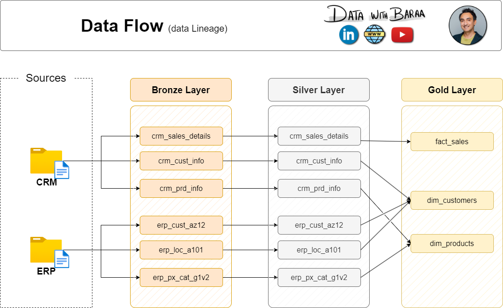
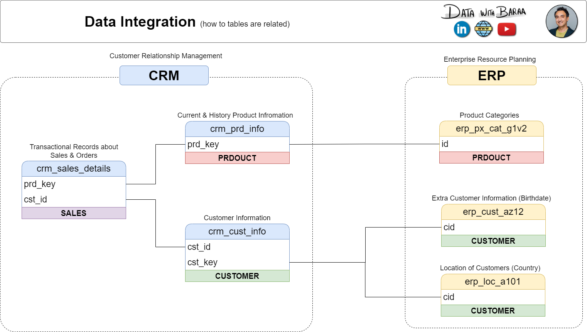
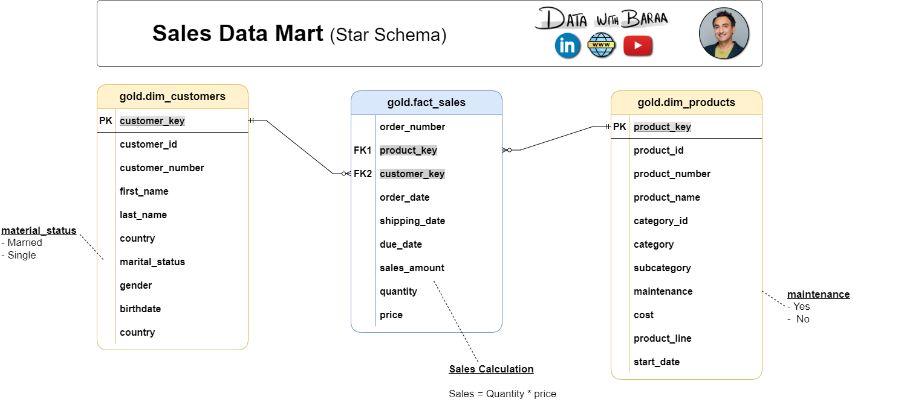

# SQL Data Warehouse & Sales Analytics

[](https://www.microsoft.com/en-us/sql-server)


[](LICENSE)

An end-to-end data warehouse built in **SQL Server** using **medallion architecture (Bronze → Silver → Gold)**. It brings together sales data from two source systems (CRM and ERP), cleans and standardizes it, models it as a **star schema**, and answers business questions about sales trends, customer behavior, and product performance using advanced SQL.

<p align="center">
  
</p>

---

## Table of Contents

- [Project Highlights](#project-highlights)
- [Architecture](#architecture)
- [Data Sources](#data-sources)
- [ETL and Data Cleansing](#etl-and-data-cleansing)
- [Data Model](#data-model)
- [Data Quality Checks](#data-quality-checks)
- [Business Questions Answered](#business-questions-answered)
- [Sample Query](#sample-query)
- [Repository Structure](#repository-structure)
- [Getting Started](#getting-started)
- [Skills Demonstrated](#skills-demonstrated)
- [Future Improvements](#future-improvements)
- [Acknowledgements](#acknowledgements)
- [Author](#author)

---

## Project Highlights

- Integrated **6 source files** (3 CRM, 3 ERP) into one analytics-ready model
- Built **stored procedures** to load the Bronze and Silver layers, with per-table load timing and `TRY/CATCH` error handling
- Fixed real data quality problems: duplicate customers, coded values, invalid dates, missing costs, inconsistent sales and price figures
- Modeled the **Gold layer as a star schema** (`fact_sales`, `dim_customers`, `dim_products`) using views
- Wrote **quality-check scripts** for both the Silver and Gold layers
- Answered business questions with **CTEs and window functions**, and packaged the results into customer and product report views

---

## Architecture

The warehouse follows the medallion pattern, where each layer has one clear job.

| Layer | Purpose | Object type | Load method | What happens here |
|---|---|---|---|---|
| **Bronze** | Raw data, as-is from the source | Tables | Full load (truncate & insert) | CSV files loaded with `BULK INSERT`, no transformations |
| **Silver** | Clean, standardized data | Tables | Full load (truncate & insert) | Cleansing, standardization, derived columns |
| **Gold** | Business-ready data | Views | None (views read from Silver) | Data integration and the star schema |

<p align="center">
  
</p>

---

## Data Sources

| System | File | Content |
|---|---|---|
| CRM | `cust_info.csv` | Customer information |
| CRM | `prd_info.csv` | Current and historical product information |
| CRM | `sales_details.csv` | Sales orders and transactions |
| ERP | `CUST_AZ12.csv` | Extra customer information (birthdate, gender) |
| ERP | `LOC_A101.csv` | Customer location (country) |
| ERP | `PX_CAT_G1V2.csv` | Product categories and subcategories |

<p align="center">
  
</p>

---

## ETL and Data Cleansing

**Bronze:** `bronze.load_bronze` truncates each table, loads its CSV with `BULK INSERT`, prints the load duration per table, and catches errors with `TRY/CATCH`.

**Silver:** `silver.load_silver` applies the cleansing rules below.

<details>
<summary><b>View all cleansing rules by table</b></summary>

| Table | Rule applied |
|---|---|
| `crm_cust_info` | Keep only the latest record per customer (`ROW_NUMBER`), trim names, convert marital status and gender codes to readable values |
| `crm_prd_info` | Split the composite product key into category ID and product key, replace NULL costs with 0, decode product line codes, derive each product's end date with `LEAD()` |
| `crm_sales_details` | Convert integer dates (`YYYYMMDD`) to `DATE` (invalid values become NULL), recalculate sales as `quantity × price` when missing or inconsistent, derive price when invalid |
| `erp_cust_az12` | Remove the `NAS` prefix from customer IDs, set future birthdates to NULL, standardize gender values |
| `erp_loc_a101` | Remove hyphens from IDs, map country codes (`DE`, `US`, `USA`) to full names, replace blanks with `n/a` |
| `erp_px_cat_g1v2` | Loaded as-is (already clean) |

</details>

**Gold:** views join the Silver tables into the final model. Gender uses CRM as the primary source with ERP as a fallback, and only current product records are kept.

---

## Data Model

The Gold layer is a star schema with one fact table and two dimensions, linked through surrogate keys.

<p align="center">
  
</p>

| Table | Type | Description |
|---|---|---|
| `gold.dim_customers` | Dimension | Customer details with country, gender, marital status, birthdate |
| `gold.dim_products` | Dimension | Product details with category, subcategory, cost, product line |
| `gold.fact_sales` | Fact | One row per order line: dates, sales amount, quantity, price |

Full column-level documentation is in [`docs/data_catalog.md`](docs/data_catalog.md). Naming rules are in [`docs/naming_conventions.md`](docs/naming_conventions.md).

---

## Data Quality Checks

Scripts in [`tests/`](tests) validate each layer after loading.

- **Silver:** null or duplicate keys, unwanted spaces, standardized values, invalid date ranges and order, and `sales = quantity × price` consistency
- **Gold:** surrogate key uniqueness, and referential integrity between the fact table and both dimensions

---

## Business Questions Answered

All analysis lives in [`analytics/SQL_EDA.sql`](analytics/SQL_EDA.sql).

| Business question | Technique |
|---|---|
| How do sales, customers, and quantity change over time? | Aggregation by year and month |
| Is the business growing? | Running total and moving average (window functions) |
| Which products beat their own average, and last year's sales? | `AVG() OVER (PARTITION BY ...)` and `LAG()` |
| Which categories contribute the most to total sales? | Part-to-whole with `SUM() OVER ()` |
| How are products spread across cost ranges? | `CASE` segmentation |
| Who are the VIP, Regular, and New customers? | Segmentation by spend and customer lifespan |
| Can I get one-stop customer and product KPIs? | Report views `gold.report_customers` and `gold.report_products` (recency, average order value, average monthly spend) |

---

## Sample Query

Running total of sales and moving average of price by year:

```sql
SELECT
    order_date,
    total_sales,
    SUM(total_sales) OVER (ORDER BY order_date) AS running_total,
    AVG(avg_price)   OVER (ORDER BY order_date) AS moving_average
FROM (
    SELECT
        DATETRUNC(YEAR, order_date) AS order_date,
        SUM(sales_amount)           AS total_sales,
        AVG(price)                  AS avg_price
    FROM gold.fact_sales
    WHERE order_date IS NOT NULL
    GROUP BY DATETRUNC(YEAR, order_date)
) t;
```

<!--
Add 2-3 Power BI or query-result screenshots here once you have them, for example:
<p align="center"></p>
-->

---

## Repository Structure

```
sql-data-warehouse-project/
├── datasets/
│   ├── source_crm/              # cust_info, prd_info, sales_details
│   └── source_erp/              # CUST_AZ12, LOC_A101, PX_CAT_G1V2
├── scripts/
│   ├── init_database.sql        # creates DataWarehouse + bronze/silver/gold schemas
│   ├── bronze/                  # ddl_bronze.sql, proc_load_bronze.sql
│   ├── silver/                  # ddl_silver.sql, proc_load_silver.sql
│   └── gold/                    # ddl_gold.sql
├── tests/                       # quality_checks_silver.sql, quality_checks_gold.sql
├── analytics/                   # SQL_EDA.sql
├── docs/                        # diagrams, data_catalog.md, naming_conventions.md
├── LICENSE
└── README.md
```

---

## Getting Started

**Prerequisites**
- SQL Server 2022 (Express is fine). The analytics script uses `DATETRUNC`, which needs 2022 or later
- SQL Server Management Studio (SSMS)

**Steps**

1. Clone the repository and note where the `datasets/` folder is.
2. In `scripts/bronze/proc_load_bronze.sql`, update the `BULK INSERT` file paths to match your machine.
3. Run the scripts in this order:
   1. `scripts/init_database.sql`
      > **Warning:** this drops and recreates the `DataWarehouse` database if it already exists.
   2. `scripts/bronze/ddl_bronze.sql`, then `scripts/bronze/proc_load_bronze.sql`
   3. `scripts/silver/ddl_silver.sql`, then `scripts/silver/proc_load_silver.sql`
   4. `scripts/gold/ddl_gold.sql`
4. Load the data:
   ```sql
   EXEC bronze.load_bronze;
   EXEC silver.load_silver;
   ```
5. Run the checks in `tests/` (each should return no rows), then explore `analytics/SQL_EDA.sql`.

---

## Skills Demonstrated

`Data Warehousing` · `ETL Pipelines` · `Medallion Architecture` · `Star Schema Modeling`  · `Stored Procedures` · `CTEs` · `Window Functions` · `Data Cleansing` · `Data Quality Testing` · `Business Analytics`

---

## Future Improvements

- Incremental loading (watermark-based) instead of full loads
- Power BI dashboard on top of the Gold layer
- Scheduling the load procedures with SQL Server Agent

---

## Acknowledgements

Built while following the SQL Data Warehouse project by [Data With Baraa](https://www.youtube.com/@datawithbaraa). The architecture diagrams, data catalog, and naming conventions in `docs/` come from the course material, shared under the MIT License (see [`LICENSE`](LICENSE)).

---

## Author

**Rajkumar Pothunuri**, aspiring Data Analyst

[](https://www.linkedin.com/in/pothunuri-rajkumar-3596ba326/)
[](https://github.com/Rajkumar1807-p)

## 🙏 Acknowledgements

Special thanks to **Data With Baraa** for providing the educational guidance and project framework that supported my learning throughout this SQL Data Warehouse and Analytics project.

This project was completed as part of my hands-on learning in SQL, data warehousing, ETL, data modeling, and analytics. The concepts and implementation were studied and adapted to strengthen my practical understanding of building an end-to-end data analytics workflow.
